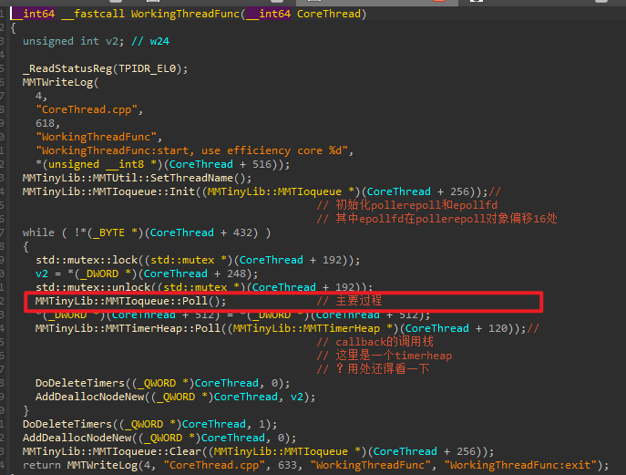
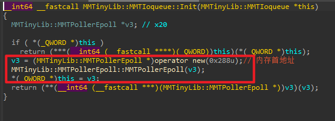
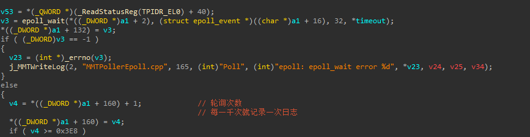
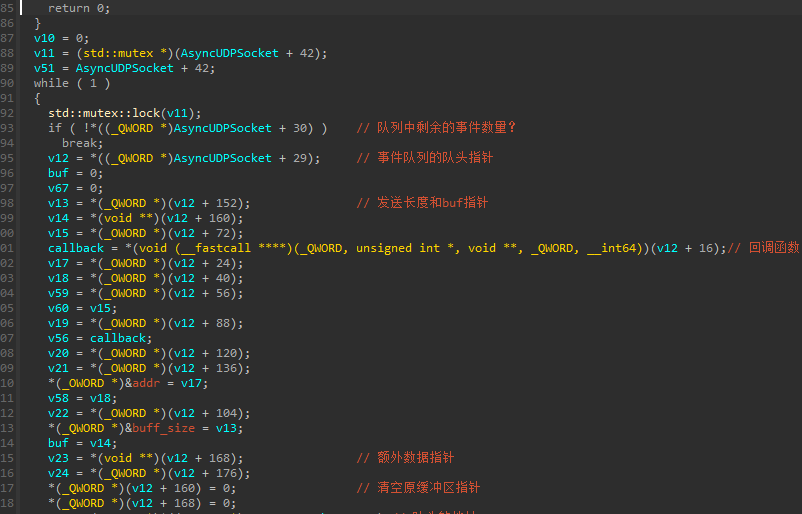
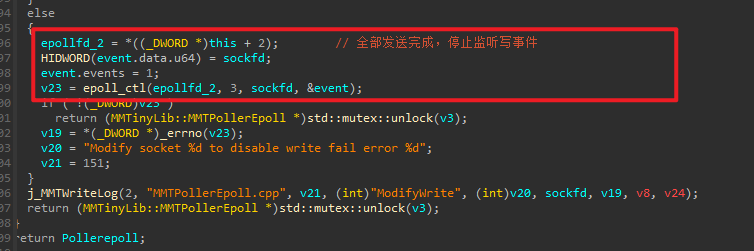
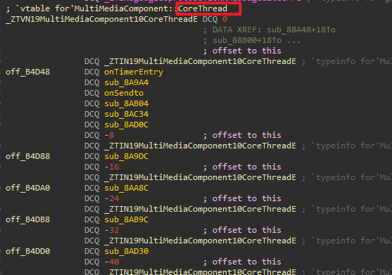
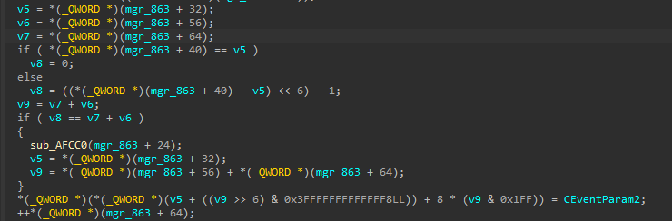
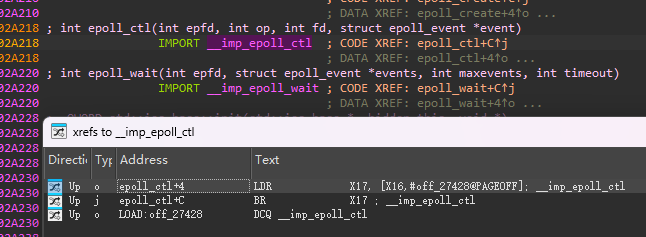
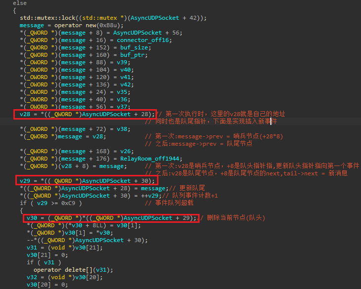

安卓so层分析入门教程——微信音视频voip引擎
(待重新修改)
目前不够精简，关键是如何思考，思路说明不够突出


## 一、准备工作

正如渗透测试要先收集目标信息，分析一个APP之前，我们先要去搜集一些相关的资料，对APP本身有个大概理解。我们此次分析的是微信音视频通话VOIP，对于VOIP的分析资料相对比较少，有两篇对我们帮助很大

```
1.https://bbs.kanxue.com/thread-260656.htm 某聊天app的音视频通话逆向
2.https://mp.weixin.qq.com/s/7RTWiL6HzRLJvEdW00iJpg 某信语音通话分析
```

其中第一篇简单分析了通信中的一个数据结构，第二篇分析了udp数据加密密钥的来源。

两篇文章虽然分析的都是之前的版本，但是对我们理解新版本也提供了不少帮助。特别是开启日志、frida hook native打印堆栈并追踪核心流程这些操作，非常值得学习。

我们自己分析时第一件事准备好几个工具：frida、ida、lldb、mt管理器，工具使用方法这里不介绍。先通过mt管理器查壳，发现没有加壳、so也没混淆且存在大量日志代码，这些是有利因素。但是VOIP开头的so就很多，业务代码分布在多个so中；使用新线程轮询事件队列，这样就出现一个问题堆栈回溯定位代码失效，事件生成、事件对象、事件队列这些都需要分析；每个操作都涉及到跨模块的回调，回调函数可能也要分析；引擎中存在多种协议情景，存在一种协议兼容多场景，且调用栈复杂；定时器和配置同步问题；通过protobuf实现java层和so层交互，不容易通过java获取信息，以上这些都是不利因素。

## 二、分析流程

### 2.1 日志

先随便打开两个so，简单看一下so中代码的特点，发现大量通过MMTWriteLog写日志的操作。这个MMTWriteLog是一个导出函数，因此马上得到一个思路：hook MMTWriteLog日志函数，查看音视频过程中打印出来的日志。

日志函数代码实现在VOIPComm.so中，从名字就可以知道这个so是一个comm模块，负责日志、网络数据收发操作。这里我们先看一下这个日志函数的参数，第一个参数大概是一个日志等级，然后是源码所在的文件，第三个是行数，第四个是当前调用这个日志函数所在的函数名称，第五个是详细信息。


然后看实现代码：v5 = off_26ED0，后面通过函数指针去调用v5这个函数，说明off_26ED0才是真正执行日志记录的地方


off_26ED0` 是一个指向 `MMTinyLib::logWriter类的指针，那么我们只要通过xref看一下哪里对这个类进行初始化


果然有一个MMTSetLogWriter，也就是通过MMTSetLogWriter把off_26ED0这个全局变量指向一个具体的日志对象


在init_proc里面调用SetLogWrite初始化了一个VoipLogger，VoipLogger里面用腾讯的_xlogger组件来写日志


简单方法就是直接用frida主动调用init_proc，然后hook VoipLogger::WriteLog看日志具体的值。当然最好还是看xlog的日志，但是xlog是加密的，而且无关日志太多。就先hook MMTWriteLog，但是测试时发现一旦hook日志函数，那么通信就建立不起来，VOIP某一步有性能限制，hook日志时造成性能问题？

### 2.2 IOqueue和Poller

由于通话不能建立，日志中只能看到一些建立通话时的流程，比如邀请、初始化编解码引擎等。因此还是选择和文章1中相同的思路，先查看数据传输，然后通过堆栈分析数据操作流程，这个是分析协议的主线，同时也避免和协议无关的内容。通过对微信音视频sendto相关的分析，我们可以学习到很多音视频开发中核心的思路，特别是微信IOqueue和Poller机制，以及对epoll机制的运用，因此我们逆向不只是把流程过一遍，而是认真研究整个数据发生机制，这一套机制在文章2简单提了一下**“通过 while 循环，会调用 MMTinyLib::CPoller::Readable、MMTinyLib::CPoller::Writeable、MMTinyLib::CPoller::Exceptable判断对应状态，之后再通过 MMTinyLib::MMTIoqueue::Poll 函数中，调用系统 poll(struct pollfd *fds, nfds_t nfds, int timeout) 函数，获取到 socket 发送数据”**实际上新版本把一个数据包发出去的过程远非这一句话所能描述。整个过程非常精彩，值得我们认真研究。

### 2.2.1 UDP数据包是怎么发出的？

所有的udp都是需要通过sendto来发出去，hook sendto所在的MMTSockSendto导出函数发现，有四个线程调用了MMTSockSendto，关键是其中两个

```c
0x761fc65074 libvoipComm.so!_ZN9MMTinyLib10MMTIoqueue21DispatchWritableEventEPNS_14AsyncUDPSocketE+0x15c
0x761fc64754 libvoipComm.so!_ZN9MMTinyLib10MMTIoqueue8DispatchEPNS_13DispatchEventEj+0x1c4
0x761fc6455c libvoipComm.so!_ZN9MMTinyLib10MMTIoqueue10NotifyPollERKNSt6__ndk16chrono8durationIxNS1_5ratioILl1ELl1000EEEEERj+0x4b4
0x761fc64820 libvoipComm.so!_ZN9MMTinyLib10MMTIoqueue4PollERKNSt6__ndk16chrono8durationIxNS1_5ratioILl1ELl1000EEEEERj+0x78
0x75c5dc8de0 libvoipChannel.so!0x8ade0
0x75c5dce5c4 libvoipChannel.so!0x905c4
0x75c5dd2cd8 libvoipChannel.so!0x94cd8
0x75c5dd2c18 libvoipChannel.so!0x94c18
0x75c5dc98b4 libvoipChannel.so!0x8b8b4
0x75c5dc7640 libvoipChannel.so!0x89640
0x761fc69010 libvoipComm.so!_ZN9MMTinyLib12MMTTimerHeap4PollEv+0x4c8
0x75c5dc6f90 libvoipChannel.so!0x88f90
0x75c5dc8e7c libvoipChannel.so!0x8ae7c
0x779e7ac54c libc.so!_ZL15__pthread_startPv+0xd4
0x779e745f40 libc.so!__start_thread+0x48
0x779e745f40 libc.so!__start_thread+0x48


0x761fc65074 libvoipComm.so!_ZN9MMTinyLib10MMTIoqueue21DispatchWritableEventEPNS_14AsyncUDPSocketE+0x15c
0x761fc64754 libvoipComm.so!_ZN9MMTinyLib10MMTIoqueue8DispatchEPNS_13DispatchEventEj+0x1c4
0x761fc6455c libvoipComm.so!_ZN9MMTinyLib10MMTIoqueue10NotifyPollERKNSt6__ndk16chrono8durationIxNS1_5ratioILl1ELl1000EEEEERj+0x4b4
0x761fc64820 libvoipComm.so!_ZN9MMTinyLib10MMTIoqueue4PollERKNSt6__ndk16chrono8durationIxNS1_5ratioILl1ELl1000EEEEERj+0x78
0x75c5dc6f74 libvoipChannel.so!0x88f74
0x75c5dc8e7c libvoipChannel.so!0x8ae7c
0x779e7ac54c libc.so!_ZL15__pthread_startPv+0xd4
0x779e745f40 libc.so!__start_thread+0x48
0x779e745f40 libc.so!__start_thread+0x48

```

2.2.2 Channel中的轮询过程

第二种情况简单一点，我们先分析第二种。libvoipChannel.so中启动了一个新的线程，线程中执行WorkingThreadFunc，WorkingThreadFunc中存在一个while循环，在这个循环中通过调用Poll实现轮询IOqueue队列中的消息。WorkingThreadFunc函数的参数是一个CoreThread对象，CoreThread对象+256处是一个IOqueue对象，外部会把消息都加入到这个队列中，Ioqueue前八字节是一个pollerepoll对象，pollerepoll对象+8处是一个epollfd，+0是一个虚函数指针。epollfd这个涉及到linux中的epoll，微信使用epoll实现非阻塞的socket



前面我们大致描述个这个机制中的一些对象，然后看一下Poll函数是怎么实现轮询的，Poll函数在comm.so中，第一个参数是MMTIoqueue


this是Ioqueue，我们前面说过Ioqueue前八个字节是pollerepoll，pollerepoll前八个字节是虚函数地址，


因此this两次解引用就是拿到了_ZTIN9MMTinyLib14MMTPollerEpollE的地址，偏移114计算可得GetMultiPlexingPollerType，这个函数始终返回3，那么很明显Poll函数就是走NotifyPoll


NotifyPoll中又是通过函数指针去调用虚函数来实现各种功能


### 2.2.3 虚函数和函数指针

这里我们先不进行下去，而是先学习函数指针在逆向分析中的核心作用，可以说**“在 ARM64 架构中，函数指针是识别动态控制流、结构体对象行为、插件系统、消息分发和回调机制的核心线索”**，同样，作为入门分析教程，我们需要揭示函数指针如何成为理解Poller机制的钥匙，一般c++对象前八字节应该是虚表指针，然后解引用两次得到第一个虚函数的地址，但是这里调用Poll时，ida识别出来了(CoreThread + 256)是一个(MMTinyLib::MMTIoqueue *)类型的对象


然而Poll里面解引用两次，却执行到了


MMTPollerEpoll虚表中的_ZN9MMTinyLib14MMTPollerEpoll25GetMultiPlexingPollerTypeEv，不是同一个对象，这一定是有问题的


通过这个问题，我们就发现了在循环前面有一个MMTinyLib::MMTIoqueue::Init，


把Ioqueue前八字节置为了v3，而v3在ida中解释成MMTPollerEpoll对象



我们看到MMTPollerEpoll是对MMTPollerEpoll对象的初始化，且首地址跳过了RTTI直接指向第一个虚表函数


这可能是音视频通话中为了性能考虑的通用做法。再往下看，+8偏移存放的正是epoll_create创建的epollfd，


在VOIP引擎中，初始化函数都非常重要，某些函数为什么传某个偏移，都是要从初始化过程中去理解，这在后面还有大量的示例。比如pollerepoll+8是epollfd。这些重要的文件描述符和对应偏移的对应关系，也可以作为一种“锚点”信息，通过某个epoll函数传的是不是pollerepoll+8这个“锚点”，我们就知道自己之前的逆向分析思路是否朝向正确方向。

### 2.2.4 NotifyPoll

然后我们继续看MMTinyLib::MMTIoqueue::NotifyPoll，又是调用pollerepoll的方法，而且参数是一次解引用，说明是pollerepoll对象


MMTinyLib::MMTPollerEpoll::Poll里面是一个epoll_wait，epoll_wait第一个参数是a1+8，epollfd没问题，第二个是events数组用来接收返回事件，地址在+16，v3是事件数量，放在了+528，然后判断轮询超过1000次就写一次日志，后面都是写日志的代码



回到MMTinyLib::MMTIoqueue::NotifyPoll，epoll_wait返回之后是一个do-while循环，红色框是MMTinyLib::MMTPollerEpoll::Dispatch开始对返回的事件数组进行处理


epoll_event数组

这里我们先要理解epoll_event，events每个元素的前四个字节事件类型，后面四字节表示fd

```c
sizeof(struct epoll_event)   16字节
struct epoll_event {
    uint32_t events;     // 事件掩码，比如 EPOLLIN、EPOLLOUT、EPOLLERR 等
    epoll_data_t data;   // 用户自定义数据（通常是 fd 或 pointer）
};
typedef union epoll_data {
    void        *ptr;
    int          fd;
    uint32_t     u32;
    uint64_t     u64;
} epoll_data_t;
```

然后就可以看MMTinyLib::MMTPollerEpoll::Dispatch了，第一轮这个done_event_cnt是0，也就是首地址，但是我们知道事件数组是+16开始的，所以这里每次跳过16字节，也就是把事件类型放在了a4中；跳过24字节拿到对应的socketfd放在了a3中，由于a3和a4传入的都是地址，所以MMTinyLib::MMTPollerEpoll::Dispatch就接收到了对应的值。上面我们其实已经重新命名了。


那这个MMTinyLib::MMTPollerEpoll::Dispatch就解析完成了。每一轮解析一个元素，由于poll_wait的原因，所以do while最大只能解析32个fd，后面会有所体现。

MMTinyLib::MMTIoqueue::NotifyPoll再后面的代码，如果不了解Minilab::MMTIoqueue对象的内存布局和AsyncUDPSocket就看不懂了。因此我们先分析AsyncUDPSocket和MMTIoqueue对象，后面再来看这些就豁然开朗。


## 2.3 分析对象初始化和内存布局

MMTIoqueue的初始化是比较早的，pollerepoll的初始化是比较晚的，为什么这么说，是因为，Channel.so中存在一个核心的对象——mTransportChannel，在连接建立之初，中间层调用CreateChannelInstance创建了一个channelInstance，当然这个channelInstance在中间层(ConfService)中称为mTransportChannel，而在Channel.so中我们叫做channelInstance，


初始化过程，虚函数都重命名过


在channelInstance+440的偏移sub_5C93C又创建了一个新的对象我们称之为connector，connector+280创建了CoreThread


CoreThread初始化过程，调用MMTinyLib::MMTIoqueue::MMTIoqueue对CoreThread+256处这个对象初始化


conn和AsyncUDPSocket

数据包依赖socket，而VOIP对socket进行了封装，我们前面提到channelInstance提供一系列虚函数，每个虚函数都在中间层通过函数指针调用，且第一个参数往往就是channelinstance本身。关键的虚函数是这三个，上面那个过程就是channelinstance_init初始化，init后会调用setconfiginfo设置连接中各种信息。然后在进行音视频时，会根据业务场景(setconfinfo)调用AddNewRelayConn或者AddNewDirectConn


AddNewRelayConn或者AddNewDirectConn本质上是一样的，我们只看一下AddNewRelayConn：申请内存、调用CreateRelay


CreateRelay中创建RelayMgr


然后又在CreateRelayConn中创建Relayroom


在整个CreateRelay完成后，最终就是实现创建ConnInfo、RelayRoom、RelayMgr

```c++
class ConnInfo{
    +0      4字节  6
    +4      4字节  conn_id
    +8      8字节  RelayRoom *
    +16      8字节  RelayConnAttrInfo *
    +24      8字节  RelayConnStatInfo *
    +32      8字节  RelayConnCallBack
    +40      8字节  channelInstance
}
class RelayMgr{
    +16 WecallPkgCryptor或&off_B3828:PkgCryptor relay是WecallPkgCryptor
    +24  connector + 192 hashtable
    +32 connector + 280  CoreThread *
    +40 connector + 8    uin的MD5值  
    +48 connector + 24   
}
class connector{
    +0  connector_state 0-未初始化,1-正在,2-初始化
    +4  CoreThread是否初始化 1 已初始化
    +8  uin的MD5值(前8字节)
    +192 hash表指针，这个hashtable每个节点存储的都是和连接相关的信息，connid对应的ConnInfo
    +280 CoreThread*
    +800 NicAddrMgr
    +960 NicAddrMgr
    +1640 MMping
}
class RelayRoom {
    +8       uin
    +16      roomid
    +24      "xep@624!Ja?g3145"
    +98       relay_data_body_enc_type
    +136       audio_encrypt_type_for_multitalk
    +138       video_encrypt
    +780       4字节   conn_id
    +784       4字节   UDPSocket
    +791       NewCoreSocket*
    +808      CoreThread *
    +816      RelayMgr *
}
```

代码中存在大量FIndConn，FIndConn的返回的就是connInfo对象，一般都是通过FIndConn拿到connInfo,然后通过偏移获取relayroom对象，relayroom中有各种参数，用来操作数据。AddNewRelayConn中CreateRelay完成之后，会通过OpenConn创建AsyncUDPSocket传输数据，OpenConn中还有一个SetRelayRoomInfo，调用sub_6CB7C


通过sub_6CB7C日志，说明RelayRoom+1904很可能是一种密钥，如果有用我们再仔细分析


SetRelayRoomInfo之后是RelayCheckIn，调用了两次GetNewCoreSocket，GetNewCoreSocket倒数第二参数不一样，大概是ipv4或者ipv6差别


在GetNewCoreSocket中调用CreateCoreSocketNew，CreateCoreSocketNew中调用comm模块的MMTinyLib::MMTIoqueue::CreateUdpSocket创建一个socket，第四个参数用来接收AsyncUDPSocket指针


看一下MMTinyLib::MMTIoqueue::CreateUdpSocket，通过CreateAsyncSock创建一个socket，socketfd在fd中，然后凭借sockfd封装一个AsyncUDPSocket


封装完成之后是两个核心步骤，把sockfd作为键，AsyncUDPSocket*作为值，插入到Ioqueue+8开始的一个hashtable结构中，把sockfd插入到pollerepoll的红黑树中


通过这里才能确定Ioqueue的结构

```c
struct IOqueue {
    +0       8字节   MMTPollerEpoll* poller
    +8       8字节  hash_table<int, AsyncUDPSocket*> 桶数组指针
    +16      8字节  哈希表当前拥有的桶数
    +24      8字节  链表的头指针，指向所有节点的单链表的第一个节点
    +32      8字节  元素数量，记录哈希表中的键值对总数
    +64      8字节  扩容机制
    +88      40字节  std::mutex mutex
    +128     4字节   int max_sockets (可选)
    +132     8字节   void* context (可选)
    +152   已发送事件？
    +204    超时时间
};
```

此外，AsyncUDPSocket有两处偏移值得注意，+28 * 8和+29*8都是指向+28 * 8的，这种小的细节我们往往容易忽略，两个相邻的内存地址且都指向第一个内存地址，这是一种在VOIP中是很常见的初始化队列中哨兵节点的操作，这个关键点对于后面我们理解数据消息出队列入队列有重要作用。如果没有注意这一点，会导致我们在分析消息队列出队时百思不得其解。


至此创建socket和AsyncUDPSocket就搞清楚了，然后CreateCoreSocketNew中会调用comm中的StartRecvfrom


把回调关联上AsyncUDPSocket，关键是ModifyRead，这里a3是1，通过epoll_ctl监听EPOLLIN和EPOLLOUT，那么可以想象，epoll_wait这个会马上触发这个fd的事件


现在我们知道了存在着一个conninfo和socket结构，但是conn和socket怎么关联起来的呢？这个是在socket插件过程中实现的。

在CreateCoreSocketNew时，返回的并不是AsyncUDPSocket，而是一个CoreUdpSocket


CoreUdpSocket+8才是AsyncUDPSocket


然后CreateCoreSocketNew中回调在创建ConnInfo时传入的RelayConnCallBack回调函数


接着我们看这个RelayConnCallBack回调，调用的是channelinstance+432处的另一个回调，这个回调是什么？必须要回到channelinstance初始化时看一下


sub_41170进行初始化，那么其实就是CreateChannelInstance的参数


那么就要回到中间层找一下sub_6D344第二个参数，a1+184，而这个InitChannelEngine(a1)的参数又是oninvite时传入的参数，就是mgr


然后我们看mgr+184，是off_B38E8，而off_B38E8       DCQ sub_60B90，也就是需要解引用两次才能得到sub_60B90


而且我们知道onrunThread中是通过解析CTaskparam2这个对象，拿到+16偏移处的dispatch函数，但是这里很明显和之前分析的dispatch不同，我们之前提到过CTaskparam2的不同使用场景


这里posttask把CTaskparam2入队列以后，通过解析，会去执行OnThreadrun，再看一次解析过程，这里OnThreadRun的v13就是CTaskparam2，就是上图v17，

然后v17+16处就是对应的dispatch


看一下这个dispatch函数，我们得先知道每个参数是什么


+6896就是mgr，没问题


会执行v1，也就是OnTransportChannelEvent，然后看OnTransportChannelEvent


OnTransportChannelEvent中直接看case4，break以后就去调用(*v18)(v19, v20, v21, v22, v23)


关键又成了+4440的偏移是什么，其实不太好找，最好是对mgr下硬件写入断点。但是这里还有一个技巧，用frida怎么定位对象某个偏移处在哪里被赋值？调用callback时，汇编指令是blr x8，那么只要知道x8寄存器的内容，然后用这个内容减去各个模块的基地址即可。由于这个回调内容过于复杂，大概就是执行一下额外操作，不影响我们理解后续内容。


然后在RelayRoom偏移792处关联上socket和conn，这是一个重要信息，如果一个conn对应多个socket，那么根据代码风格这里应该是一个链表或者hashtable操作，只有一句这说明一个conn对应的socket是有限的，接着再创建一个ipv6客户端，关联在RelayRoom+800。而前面ioqueue和pollerepoll关联socket时却采用了hashtbale和红黑树，而且ioqueue和pollerepoll是在channelinstance中初始化内存，Relayroom、Relaymgr、conninfo却是在AddNewRelayConn时才创建的，最终把ConnInfo加入到connector+192的hashtable中，


至此我们终于理清楚了各个对象之间的关系

## 2.3 消息队列的消费

2.3.1消息出队列

如果一个对象的内存没有搞清楚，迟早会被后面某个步骤卡住。比如dispatch的解析hashtable的一系列操作，如果我们不先去分析几个对象的初始化，很容易完全看不懂某个过程在干什么，为什么这样操作。作为新手教程，前面展示的都是通过大量分析后的结论。好像是顺序分析、一气呵成，但是实际上自顶向下的分析并不简单。

往往我们都得从一个系统函数出发，往上一层分析。或者我们其实是先分析到dispatch，然后才发觉Ioqueue中存在一个hashtable，再通过Ioqueue的初始化反证出分析的正确性。但是实际上，hashtable或者红黑树、队列这些操作或者数据结构的反编译代码即使在不同的程序中也会存在大量相同点。也就是算法的反编译代码有“模板化”特征。

对于模板化的代码，人的分析效率并不如ai，因此分析代码时应该首先把和算法有关的复杂反编译代码交给ai，提取出要点，大概了解这个操作是做什么。然后人力根据这些操作，帮助于业务代码的分析。但是也不能完全依赖于ai，ai有时候也会犯错。

下面我们就继续分析Notifypoll，this+2我们知道是Ioqueue的hashtable相关的结构，hashtable存储的是一个hash_table_node这个节点的结构如下

```c
struct hash_table_node {
    Offset 0 (_QWORD)：指向下一个节点的指针。
    Offset 8 (_QWORD)：哈希值（对于 int 键，通常等于键本身）。
    Offset 16 (_DWORD)：键（int 类型）fd
    Offset 24 (_QWORD)：值（MMTinyLib::AsyncUDPSocket *）asyncUdpsocket
}
```

其实就是取出hash_table_node，然后拿到asyncudpsocket


后面就不看了，拿到node以后，就要判断这个epoll_wait触发了这个socket的哪些事件,然后把事件放到 **s** 这个事件数组中，每个事件应该是占2* 16=32个字节，第20字节表示事件类型，然后前4字节是asyncUudpsocket


判断有没有超过32个socket都有读写事件，超过就调用dispatch立即分发32个socket的事件。


dispatch中根据事件的第20字节判断是一个socket的读事件还是写事件，比如看写事件


udp的偏移16没有赋值，所以走下面，且参数是MMTinyLib::MMTIoqueue *和asyncUudpsocket*


在dispatchWriteableevent，每次拿队头的事件节点，取出数据



取出数据后，我们看到这里v25 = (_QWORD *)*((_QWORD *)AsyncUDPSocket + 29)是取出队头节点，* `*(_QWORD *)(*v25 + 8LL) = v25[1]` 这里不好理解，*v25其实就是取出哨兵节点的首地址(要结合入队操作分析)然后哨兵节点首地址是AsyncUDPSocket + 28，再偏移8就还是AsyncUDPSocket + 29，把这里赋值成头结点的next；`*(_QWORD *)v25[1] = *v25`这里把头结点的next节点的前八个字节赋值为哨兵节点。这里容易理解成链表的curr->prev.next = curr.next，curr->next.prev = curr.prev，这样虽然没错，但是会发现少了更新头结点的过程`*((_QWORD *)AsyncUDPSocket + 29)  = v25[1]`但是如果理解了队头节点的前八字节指向哨兵节点，就能够解释这个问题。


上面拿到数据和sockfd后调用MMTSockSendto


一个socket的消息队列发送完后，也就是偏移240为0了，就调用MMTinyLib::MMTPollerEpoll::ModifyWrite


ModifyWrite中最重要的操作就是通过sockfd从pollerepoll对象红黑树中查找是否已经加入了epollfd的监听，如果是就epoll_ctl停止epoll_wait再监听这个socket的EPOLLOUT，避免了epoll_wait大量返回，这样就和socket创建时的epoll_ctl联系起来了，写事件完成就禁止监听写事件。数据出队列我们就搞清楚了，后面我们继续分析数据怎么入队列，这里也包含我们最关心的协议和加密内容，以及消息生产者如何通过epoll_ctl协调epoll_wait实现高效异步socket。



2.4 分析思路总结

2.4.1 从最基本的函数出发

分析消息生产之前，我们还是要再总结一次分析思路。前面文章中，是在已经知道某个功能是什么的情况下介绍某些流程。但是实际上我们自己分析时，不知道上面这个出队列的过程，要得出这些结论，应该反过来的去分析。先根据sendto这个系统函数，还原出最根本的参数sendto(fd, buf, n, flags, &addr, v21)


变量重命名之后，发现socketfd和buf都是MMTSockSendto传入的参数


根据这些信息，继续往上找到DispatchWritableEvent调用MMTSockSendto的地方，首先第一个参数是解引用，这说明一定是一个对socket封装的结构或者fd本身的指针，这个结构中封装了socketfd，然后找buf来源


buf最终来源于v12的某个偏移，v12又来源于AsyncUDPSocket，那么即使我们不知道消息队列，也应该知道AsyncUDPSocket中有一个对象是封装了buf，然后进一步分析这个对象的操作过程


拿到buf以后，这种反编译代码，很明显是双向链表相关的，因此我们就能判断这个偏移是队列头相关


2.4.2 从导出函数出发

一般来说跨so调用对象方法，Channel中要提供一个导出函数，我们看名字就知道CreateChannelInstance肯定调用了sub_41170实现一个全局的CTransportChannel对象，提供给别的模块使用


点进去看一下，果然，而且解决了另一个问题也就是CreateChannelInstance需要一个参数是ILogWriter *类型，那么可以对这个函数进行hook，查看调用栈，继续往上分析ILogWriter具体内容，这里就不分析了


重点看一下Channelinstance偏移+440的地址，进行一些额外处理，说明很可能是一个对象的内存


进到sub_5C93C，又是大量初始化操作，其中这个对象内部偏移280应该又是一个新对象，一般来说初始化内存意味着new一个对象，只是缺乏日志，暂时没办法知道这个对象的作用，但是我们还是可以根据后面哪些地方使用到这个对象来反推出来。


看一下sub_88A48，一般类似下面这种首地址被赋值成一个off_12345，要先看一下这个地址，如果这个地址对应一个虚表中首个虚函数，那么就能判断，这个对象是虚表对应的对象


比如这里，根据off_B4D48，就能判断connector+280是一个CoreThread类的实例。这个channelInstance+440为什么是connector我们后面分析



此外这里初始化了ioqueue，这是个有用信息，后面只要看到这个a1+256就很容易a1对应的是corethread


CreateChannelInstance初始化完成后。后面的思路最简单的就是找一找别的模块中哪里调用了CreateChannelInstance，比如发现在confService的sub_6D344，我们前面强调了函数指针在逆向分析中的核心作用，有了对函数指针的理解，只需要看函数指针的偏移就能知道是去调用对象的哪个虚函数


在分析一个对象的时候，初始化函数还是要认真看一下。通过对象初始化函数，能迅速对一个对象的内存布局有大致理解。前面一节提到的系统函数，本身是一种锚点信息，通过固定的锚点信息能自底向上反推内存布局；而这一节我们展示自顶向底把特殊偏移转化成锚点信息。

比如上图第二个红色框就是偏移+0x10的那个函数，大概就是对channelInstance初始化。


一行一行看，那么+384就是一个标志，如果非零就代表已经初始化过了。然后我们看到有一个+440的偏移，很显然这个偏移十分重要。byteArray是函数指针传入的一个字节数组，但是这个数组调用时是空的。我们就看这个日志，日志里面写的是"Init:connector startup error"从这句日志我们马上断定，channelInstance+440是一个对象，叫做connector


4.4.3 xref的思路

接下来我们通过使用xref的一个示例，展示前面提到的中间层的分析过程。channelInstance对象初始化完成，给到transChannel+8，我们就往上找，看一下这个怎么来的


是a1+536


追踪外层a1对象，在oninvite里面


也是oninvite的第一个参数


oninvite的来源是ConfCallMgr_dispatch，且和ConfCallMgr_dispatch第一个参数是同一个对象


而ConfCallMgr_dispatch又来源于dispatch。dispatch传入参数偏移8的地方


dispatch再网上找，没有直接调用了，怎么办？


那我们就看这个虚表，看一下虚表off_B3168什么时候初始化的


比如虚表off_B3168在WXConfService初始化过程中


WXConfService_init中a1是一个this，a1[1]是一个mgr


根据虚表，暂时把a1命名为WXConfServiceInstance,a1[1]命名为WXConfServicemgr，后面直接简写为mgr


WXConfService_init中初始化一个CEventParam2对象，然后调用postTask


postTask先把CEventParam2加入到mgr[863]处的对象偏移32的地方，这里应该是一个队列管理相关的结构，然后根据mgr[863]+8是否有线程句柄阻塞新线程的创建，没有句柄就启动了一个新线程函数Start，避免了额外创建线程的开销


Start在v5是OnThreadRun，v4是0，v6就是上图的a1，也就是mgr[863]


然后我们看到OnThreadRun，关键点就是一个while循环和函数指针的跳转。*(_QWORD *)v13 + 16LL是从队列中拿到虚函数的地址


我们前面已经知道dispatch是off_B3168+16，


OnThreadRun中的v13肯定是我们在WXConfService_init中看到CEventParam2的实例v59，但是我们知道OnThreadRun的参数只有mgr[863]，CEventParam2是怎么得到的呢？


CEventParam2和mgr[863]都是postTask的参数，我们需要看到postTask这段代码，虽然我们不能确定具体的数值，但是大概就是把CEventParam2添加到mgr的某个事件队列中



然后在OnThreadRun通过相反的操作取出来CEventParam2对象


CEventParam2分析

现在我们大概知道了dispatch中的CEventParam2每个偏移大致的用处了。这个第二个是命令类型，决定dispatch走哪一个分支，后面两个protobuf数据都是额外信息，这两个大概率是和java层有交互。


那么现在我们理解了为什么dispatch要用函数指针调用。前面bindsocket时其实提到过，这样兼容了不同的event类型，一种是中间层向下给Channel来transport，一种上中间层向上回调写日志。

我们现在对上面这个过程再进一步抽象：外部构造一个CEventParam2包裹，通过postTask把这个包裹加入到mgr[863]的event队列中，然后启动一个新线程执行到OnThreadRun。OnThreadRun通过while轮询event队列，从队列中取出CEventParam2包裹，解析出一个虚函数地址，然后通过函数指针调用这个虚函数。

对PostTask进行xref，发现了使用的场景非常多


比如我们看到这个使用场景


再比如这个场景，第二个参数就是47，对应不同的操作


有了上面这些关键信息，我们从更高层面来抽象这个过程：构造eventpara，然后通过post入队列，在OnThreadRun中出队列，dispatch分发事件执行不同操作。上面最关键的一步是我们知道了有很多地方在构造这个eventparam，具体是哪些呢，比如WXConfService_init中，这是一个虚函数，那么肯定是从别的so中通过函数指针这种方法调用的。


根据我们前面的总结，每个so提供一个Instance供其他so使用，我们看一下ConfService的Instance


这个对象非常简单


在别的so中获取到这个Instance后通过偏移0x0调用WXConfService_init，第一次调用时0x8我们知道是0


直接执行这里，这样就豁然开朗了，ConfServiceInstance的0x8就是Mgr，这也符合日志中的信息


mgr的特点就是存在大量继承protobuf的类，用来初始化各种关键配置。然后我们再看一下invite的调用栈sub_A5C04


同样的是一个虚函数


大部分虚函数都对应着一个构造eventparam2的方式，也就是后续分发到不同的分支，然后执行不同的操作。这样就通过ConfService这个中间层来实现了业务上的解耦。

一个典型场景就是Codec专门编码音视频数据，然后调用中间层的Notify_data把数据transport到Channel，Channel中再处理后交付给Ioqueue，comm中的Poller轮询到数据后发出；另一个是网络层获取的room、key等各种序列化数据通过Mgr反序列化transport到Channel实现各种加密参数的初始化。因此理解ConfService对理解voip引擎至关重要。

ConfServiceInstance提供了一系列虚函数和回调，通过这些函数对事件进行封装加入mgr的event队列，在OnThreadRun分发。更上层的调用我们就不看了，然后我们重点分析通话建立过程的流程，当然可以先把虚函数重命名一下，这里命名成Notify格式，但是实际上可以不加Notify，因为实际的业务代码是invite-Oninvite这种配对模式，

2.5 消息队列生产者

我们已经知道数据怎么发出的，通过Poller轮询，epoll_wait获取epollfd对应的socket事件，写事件分发完成后又把epollfd对应事件变成只读。那么要分析消息入队，是不是只需要看哪里**通过epoll_ctl把epollfd监听标志改成EPOLLOUT即可**，另一个思路是对asyncudpsocket消息队列队尾指针下硬件断点，找到写入时的调用栈。这里我们演示法1，首先在comm模块中搜索epoll


找epoll_ctl的调用



定位到ModifyWrite，如果要发送数据，epoll_wait必须收到EPOLLOUT事件，而epoll_ctl只在a3为1时才会修改成5，startrecv时a3是1，因此还要知道什么时候是传入1


找到函数在哪里被调用，在VOIP引擎中我们梳理一下常见的方法。第一种就是在同一个模块中被调用，第二种是通过导出函数被调用，第三种是跨模块通过函数指针调用虚函数。软件开发时一般架构师会设计Base基类，comm公用模块。而这里voipcomm模块是公用的，基本不会变化的。函数都是导出的。但是问题又来了，这个导出函数是MMTinyLib::MMTPollerEpoll的虚函数，我们知道MMTinyLib::MMTPollerEpoll的虚函数都是函数指针的方法去调用的。只能通过打印堆栈吗？其实理解了函数指针通过ida也可以直接找到。在初始化pollerEpoll时，第一个虚函数被跳过了，那么要通过函数指针调用ModifyWrite是不是偏移0x20就是+32


通过函数指针调用虚函数的汇编指令是怎样的？特征是不是“,#0x20]”

```assembly
LDR             Xn, [Xn,#0x20]
BLR             Xn
```

直接ida搜索


找到ldr紧接着blr


对指定地址，按tab键可以直接反编译，而不要直接f5反编译，tab能把跳转地址对应起来，在分析堆栈时很有用


看一下这个函数MMTinyLib::MMTIoqueue::Sendto，函数签名如下


然后直接看sendto的代码，肯定是把消息加入到asyncUDPsocket的事件队列中，先不管别的，一看到+28+29+30里面想到是事件队列，哨兵节点第一次操作和后续操作要分开才好理解。知道哨兵节点之后，再看注释就好理解了，每次构造一个message对象，如果一块内存有目前的布局，那么可以认为他是一块结构体，当然因为我们比较熟悉java，java中这些都是对象，我们也认为这种申请内存赋值的操作是对象(匿名对象、结构体)初始化。

队列操作逻辑上一定是插入到队尾，那么第一个红色框就是获取队尾指针。把messag的前八个字节修改成队尾节点的地址即current->prev = tail；把队尾节点+8也就是队尾节点的赋值成新构造的message，即tail->next = current，实现入队操作。



而且我们注意一点，messag+8是什么？照理来说，这个值应该是curren的next，肯定不是随意的内容，AsyncUDPSocket+56是什么内容？这里就涉及到我们前面一直没有去谈及的一个重要问题——对象中偏移的计算。


2.7 分析中注意的几个问题

我们在ida分析对象内存布局时最容易遇到的问题就是没有仔细看变量类型。内存布局的计算一定是根据变量类型来的。

一个8字节的变量，在ida中有时候是用__int64表示，有时候是int64*，有时候是_QWORD *

```c
struct MyStruct {
   uint64_t magic; 
   uint64_t id;
}obj;
```

因此同一块内存，比如这个id变量，ida表示时，有可能是下面这些情况，但是核心还是指针与int类型计算，由于ida中函数签名不会出现QWORD *类型，只需要关注签名中是int还是int *，然后再看位数即可。int使用时一般计算偏移方便，但是计算偏移后往往会看到还有一次强转(_QWORD *)对其和左边的内存

```c
//1.int *
unsigned int *obj,
obj + 2
//2.int *
__int *obj
obj + 1
//3.int类型，不管位数,都是+8，因为int类型和指针类型计算方式不同
__int64 obj
(_QWORD *)(obj + 8)
//4-1中间变量
__int64 *obj
_QWORD *v1
v1 = obj
v1 + 1
//4-2等价
__int64 *obj    
_QWORD v1[2]
v1[1]    
//5-1强转再偏移
__int64 obj
(_QWORD *)obj + 1    
//5-2强转再偏移
__int64 obj
(char *)obj + 8
//5-3强转再偏移
 __int64 obj
(byte *)obj + 8 
```

比如下面这幅图，就说明了指针加法的问题，要根据指针类型计算偏移，经常会看到很多教程讲下面这个公式

```c
ptr + N  ===  ptr + N × sizeof(*ptr)
```

这个公式ida中经常要用，比如byte*类型要偏移4，才能等于int*类型偏移1


有了上面的铺垫，我们也很容易理解这里AsyncUDPSocket是一个int*类型


因为AsyncUDPSocket的前四个字节是sockfd，被识别成int32 *是完全可以的，而下面取哨兵节点时强转成了QWORD *，所以这两个红色框表示的同一个地址，因此即使只有一个事件，后面出队列的操作也不会出问题，因为next就是哨兵节点地址


下面还要注意解引用的问题，不同类型解引用得到的数据大小也是不同的，比如上图中第一个红色框是八字节，而第二个红色框的值和v28有关系，如果v26是int64类型，那么就是取8字节

| 指针类型    | 解引用大小              |
| ----------- | ----------------------- |
| `int*`      | 4 字节（32 位）         |
| `__int64*`  | 8 字节（64 位）         |
| `char*`     | 1 字节                  |
| `float*`    | 4 字节                  |
| `double*`   | 8 字节                  |
| `MyStruct*` | `sizeof(MyStruct)` 字节 |

端序问题，arm架构写数据时是小端序，因此网络数据包中的数据可能和ida中看到的不一样，这就是小端写入导致的，遇到注意一下即可

| 场景         | 解引用大小             | 小端 or 大端 | 如何控制                               |
| ------------ | ---------------------- | ------------ | -------------------------------------- |
| 普通内存读写 | 看类型（如 `int*`）    | 小端         | 无需控制，CPU决定                      |
| 网络发送数据 | 看 `send()` 给的缓冲区 | 大端（规定） | 用 `htonl()` / `htons()` 转换          |
| 指针 + 偏移  | 偏移单位 = 类型大小    | 小端         | `obj + 1` 是 `obj + sizeof(type)` 字节 |

这个有什么用呢？比如我们自己写一个app，用udp发送两个报文，第一个就是0x1234，第二个是htons转换成网络字节顺序


抓包，只写入两个字节时，就是两字节的小端，如果是写入四字节呢？


四字节就是下面这种情况，这些端序问题在分析网络协议时经常得注意


我们再看看ida反编译处理是怎样的


说明ida反编译的自动转换成了十进制，并且不是小端序，而bswap32也要注意，往往就是涉及到字节序转换，还有就是ida如果识别成负数，那么真实数据就是补码


找一个补码转换的网站转换一下即可


Ioqueue的导出函数一般是直接调用，在Channel中看一下哪里调用了sendto，最终定位到senddatav6


再结合hook打印堆栈，最终定位到senddatav6的调用栈，最终有四个线程会调用到Ioqueue的sendto，四个线程有不同的职责。当然还要区分Relay和Direct发送的情况，这里我们只看Relay。

四条线程，每一条基本都对应不同的作用，一部分是发送通信中的音视频数据，另一些是传输控制、环境信息。四条线程逻辑上又分为五种调用情况，其中有些是发送数据后的回调上传信息。每条线程有很多，我们只取一条数据

第一条，这个不是很重要，总共只有四条记录

```c
0x711f05fccc libvoipComm.so!_ZN9MMTinyLib10MMTIoqueue6SendtoEPNS_14AsyncUDPSocketENSt6__ndk110unique_ptrIA_hNS3_14default_deleteIS5_EEEEPlPKNS_20mmt_sockaddr_storageES8_PNS_17UDPSendtoCallbackEPNS3_3mapISA_SA_NS3_4lessISA_EENS3_9allocatorINS3_4pairISB_SA_EEEEEE+0x248
0x7082dca3bc libvoipChannel.so!  SendDataV6  0x8a3bc  
0x7082dab5fc libvoipChannel.so!  RelaySendData  0x6b5fc  
0x7082d9daa0 libvoipChannel.so!  SendConn  0x5daa0
0x7082d90130 libvoipChannel.so!  OnSendRudpData  0x50130
0x7082d96c74 libvoipChannel.so!  SendRudpData  0x56c74
0x7082d85db0 libvoipChannel.so!  SendRealyudpData  0x45db0
0x7082d85258 libvoipChannel.so!  SendData  0x45258
0x707f38c298 libconfService.so!0x71298
0x707f370e10 libconfService.so!  OnSendUserStatus  0x55e10
0x707f37aff8 libconfService.so!  OnRecvUserStatus  0x5fff8
0x707f3ca724 libconfService.so! OnThreadRun-dispatch 0xaf724
0x707f3cac8c libconfService.so!0xafc8c
0x725951954c libc.so!_ZL15__pthread_startPv+0xd4
0x72594b2f40 libc.so!__start_thread+0x48
0x72594b2f40 libc.so!__start_thread+0x48
```

第二条

```c
0x711f05fccc libvoipComm.so!_ZN9MMTinyLib10MMTIoqueue6SendtoEPNS_14AsyncUDPSocketENSt6__ndk110unique_ptrIA_hNS3_14default_deleteIS5_EEEEPlPKNS_20mmt_sockaddr_storageES8_PNS_17UDPSendtoCallbackEPNS3_3mapISA_SA_NS3_4lessISA_EENS3_9allocatorINS3_4pairISB_SA_EEEEEE+0x248
0x7082dca3bc libvoipChannel.so!0x8a3bc
0x7082db5810 libvoipChannel.so!  SendCheckInPkt  0x75810
0x7082dcb8b4 libvoipChannel.so!  函数指针  0x8b8b4
0x7082dc9640 libvoipChannel.so!  onTimerEntry  0x89640
0x711f065010 libvoipComm.so!_ZN9MMTinyLib12MMTTimerHeap4PollEv+0x4c8
0x7082dc8f90 libvoipChannel.so!  核心循环 0x88f90 
0x7082dcae7c libvoipChannel.so!0x8ae7c
0x725951954c libc.so!_ZL15__pthread_startPv+0xd4
0x72594b2f40 libc.so!__start_thread+0x48
0x72594b2f40 libc.so!__start_thread+0x48

0x711f05fccc libvoipComm.so!_ZN9MMTinyLib10MMTIoqueue6SendtoEPNS_14AsyncUDPSocketENSt6__ndk110unique_ptrIA_hNS3_14default_deleteIS5_EEEEPlPKNS_20mmt_sockaddr_storageES8_PNS_17UDPSendtoCallbackEPNS3_3mapISA_SA_NS3_4lessISA_EENS3_9allocatorINS3_4pairISB_SA_EEEEEE+0x248
0x7082dca3bc libvoipChannel.so!0x8a3bc
0x7082dab5fc libvoipChannel.so!RelaySendData  0x6b5fc
0x7082d9daa0 libvoipChannel.so!  SendConn  0x5daa0
0x7082d8fcf8 libvoipChannel.so!  SendC2CCommData  0x4fcf8
0x7082d91618 libvoipChannel.so!  SendFakingData  0x51618
0x7082d91738 libvoipChannel.so!  HandleFakingData  0x51738
0x7082d88f0c libvoipChannel.so!  HandleC2CCommData  0x48f0c
0x7082d87f9c libvoipChannel.so!  OutputConnData  0x47f9c
0x7082d83250 libvoipChannel.so!  RelayConnCallBack  0x43250
0x7082daa90c libvoipChannel.so!  HandleOutPutData  0x6a90c
0x7082da8318 libvoipChannel.so!  HandleRelayPackets  0x68318
0x7082da7d88 libvoipChannel.so!  OnRecvfrom  0x67d88
0x711f060be4 libvoipComm.so!_ZN9MMTinyLib10MMTIoqueue21DispatchReadableEventEPNS_14AsyncUDPSocketE+0xc4
0x711f060718 libvoipComm.so!_ZN9MMTinyLib10MMTIoqueue8DispatchEPNS_13DispatchEventEj+0x188
0x711f06055c libvoipComm.so!_ZN9MMTinyLib10MMTIoqueue10NotifyPollERKNSt6__ndk16chrono8durationIxNS1_5ratioILl1ELl1000EEEEERj+0x4b4
核心循环
```

第三条

```c
0x711f05fccc libvoipComm.so!_ZN9MMTinyLib10MMTIoqueue6SendtoEPNS_14AsyncUDPSocketENSt6__ndk110unique_ptrIA_hNS3_14default_deleteIS5_EEEEPlPKNS_20mmt_sockaddr_storageES8_PNS_17UDPSendtoCallbackEPNS3_3mapISA_SA_NS3_4lessISA_EENS3_9allocatorINS3_4pairISB_SA_EEEEEE+0x248
0x7082dca3bc libvoipChannel.so!0x8a3bc
0x7082dab5fc libvoipChannel.so!0x6b5fc
0x7082d9daa0 libvoipChannel.so!0x5daa0
0x7082d8550c libvoipChannel.so!  senddata  0x4550c
0x707f38bdd8 libconfService.so!0x70dd8
0x707f36ad88 libconfService.so!0x4fd88
0x70cf16ef14 libvoipCodec.so!0x314f14
0x70cf1887c8 libvoipCodec.so!0x32e7c8
0x70cf0d8768 libvoipCodec.so!0x27e768
0x707f393c10 libconfService.so!0x78c10
0x7071abb188 libaff_biz.so!0x1060188
0x7071b41b0c libaff_biz.so!0x10e6b0c
0x711a8f8028 tinker_classN.odex!0x4db028
0x711a8f8028 tinker_classN.odex!0x4db028
```

第四条

```c
0x711f05fccc libvoipComm.so!_ZN9MMTinyLib10MMTIoqueue6SendtoEPNS_14AsyncUDPSocketENSt6__ndk110unique_ptrIA_hNS3_14default_deleteIS5_EEEEPlPKNS_20mmt_sockaddr_storageES8_PNS_17UDPSendtoCallbackEPNS3_3mapISA_SA_NS3_4lessISA_EENS3_9allocatorINS3_4pairISB_SA_EEEEEE+0x248
0x7082dca3bc libvoipChannel.so!0x8a3bc
0x7082dab5fc libvoipChannel.so!0x6b5fc
0x7082d9daa0 libvoipChannel.so!0x5daa0
0x7082d8550c libvoipChannel.so!  senddata 0x4550c
0x707f38bbb0 libconfService.so!0x70bb0
0x707f36ad88 libconfService.so!0x4fd88
0x70cf083d4c libvoipCodec.so!0x229d4c
0x70cf0ec24c libvoipCodec.so!0x29224c
0x70cf0ede6c libvoipCodec.so!0x293e6c
0x725951954c libc.so!_ZL15__pthread_startPv+0xd4
0x72594b2f40 libc.so!__start_thread+0x48
0x72594b2f40 libc.so!__start_thread+0x48
```

我们先观察特征，一种是Codec---->中间层------>Channel----->Comm，很显然，Codec中应该和音视频数据直接相关，经过编码交付给中间层，中间层都是调用channelInstance的senddata这个虚函数transport数据，


原始编码数据经过Channel加密、封装成为消息事件，最终在senddatav6调用comm模块的Ioqueue::Sendto，sendto中实现把消息加入到socket的消息队列中并epoll_ctl修改监听事件类型EPOLLOUT|EPOLLIN实现后续事件分发


senddatav6所在的函数，一定是完成最终加密


只分析经过Codec处理的，仍然有两种，区别在中间层通道


看一下区别，关键是第五个参数和第九第十个参数。看一下Codec，启动新线程中调用的是和服务器通信，可能是数据上报。说明最终通信数据还是和java层的thinker交互得到的。也就是下面这个0x70d90


重点还是看数据包加入队列，根据调用栈肯定是走sendconn，抽离最核心的代码，第一个参数是connector，然后把Data和Datasize放在第三第四个参数


sendconn调用RelaySendData


RelaySendData中调用PackRelayPktChaChaLive加密


最终都是调用PackLiveCloud，PackLiveCloud第一个参数是Relayroom+1904，之前我们提到过是一种key，但是具体作用还需要分析，然后是Data和data_len，v19是一个新的buf，v47是一个和relayroom中各种配置相关的数组


这里红色框是chacha20加密，其他是poly1305后面展示参数怎么还原出来的


上面sub_AA888最终的定义在loc_A49F0处，这段代码没法反编译，只能看寄存器推导每个参数的意义


sub_A4AC0实现了密钥流生成


通过chacha20算法，可以推导出：64字节状态数组经过变换生成加密密钥，密钥和明文数组a2逐字节异或，结果存储在a3中，a4是长度，


通过这些信息我们可以知道A4A38的 `BL  ub_A4AC0`这里跳转时x0-x3这四个寄存器的内容：比如由于跳转后x3是长度，x3是x8给的，x8又是x2给的，x2在arm64架构表示第三个参数，那么我们就知道第三个参数是data_len；同样x2是密文数组，以此类推还原出函数的参数


这里重点分析加密状态字还原：x0是chacha20加密状态字，指向栈sp，前16字节在栈上0x10开始，总共十六字节，然后偏移0x20是一个32字节的秘钥，因为Q0和Q3都是十六字节，而且Q0、Q3来源于[x5]，那么可知x5是一个密钥指针；偏移0x40是一个字长表示计时器，这个计数器来自于w4和w10，而w4是1，w10是空的说明计数器从1开始，符合要求；然后0x48开始是D2寄存器，而D2寄存器又来源于[x3]说明x3是一个8字节noise，再加上一开始x29被抬高0x10刚好满足0x40也就是64字节的初始状态字大小


从寄存器的状况，我们就还原出了参数的意义，然后我们从三个角度出发去往上分析

1. chachakey是生成最终加密密钥的重要部分，chachakey的来源是否有规律
2. 输出数组的内容，加密数据不会再次加密了，通过输出数组就可以分析音视频报文协议
3. noise，因为chacha20的安全性和noise也有关系，noise固定的话是容易被破解的

对变量重命名


最终在PackLiveCloud中还原出每部分的意义，其中key就是PackLiveCloud的第一个参数


2.6.2 加密参数分析

我们看到outarray并不是从0开始，而是从21字节开始接收加密数据，那么说明前面还有20字节的协议头，我们需要分析这20字节是什么内容，看到赋值，这就说明0-20字节全部来源于a6


而且加密数据并非编码的数据本身，还加上了a6第20字节开始的两个字节的数据


noise有16字节，但是加密的汇编代码中由于LDR D2,[x3]因此说明只用到了noise[0]，那还是和a6有关系


所有数据都指向a6，很明显关键就是a6，这个参数我们就命名成configarray，看一下前21字节的内容，22字节开始都是加密数据暂且先不管。来到PackRelayPktChaChaLive，这里是调用各种packlivecloud的核心分发函数，configArray是一个byte数组，看日志就知道13-14字节是一个sn，一般来说sn是一个报文序列号


15字节是一个v24 | a6 & 0xF，v24和cloud_data_type有关系，a6是中间层中决定的，有可能是0也可能是v13=2|v13=3,(data[v13] >> 3) & 0xF

那么根据赋值就清楚了，前两个字节是固定标识，第三到第十字节是relayroom+16，第十一十二字节是relayroom+40，然后是两个字节的sn


而且configarray总共只有16字节，那么后面五个字节没什么意义


那么关键又成了relayroom的分析，由于relayroom配置的修改分散多处。但是关键还是在addnewrelayconn时初始化各种参数，比如relayroom+16这个在检查连接时可知，是一个八字节的roomid，标识在同一个room


在SetRelayRoomInfo时赋值，又和第一个参数有关，这个参数最终是在channelInstance中


对应的是channelInstance+48和+56


还有一种数据包是a3开头的，我们也分析一下AddNewDirectConn


那么我们就还原出了，senddata的第一个参数是一个CTransportChannel对象，而CTransportChannel是怎样的，我们就回到Channel中不断还原。


